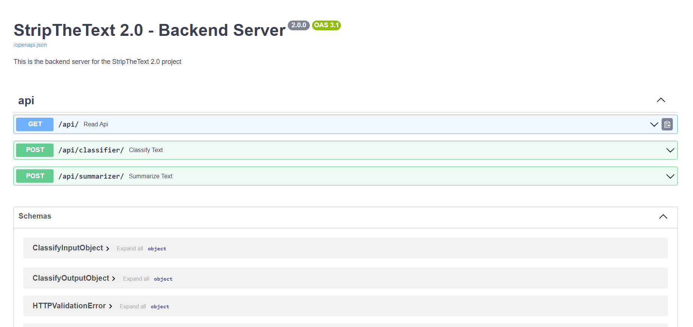

## Backend

---

### Project structure

```lua
|-- backend
|   |-- models
|   |   |-- classifier
|   |   |   |-- classification_rnn_2.0
|   |   |-- summarizer
|   |   |   |-- .gitkeep
|   |-- .gitignore
|   |-- Dockerfile
|   |-- LICENSE
|   |-- main.py
|   |-- README.md
|   |-- requirements.txt
```

### Project setup

#### Installment of dependencies with Pip

```shell
pip install -r requirements.txt
```

#### Installment of dependencies with Conda

```shell
conda install --file requirements.txt
```

### Run the Frontend

#### Run the Backend directly

```shell
uvicorn app.main:app --host localhost --port 8000 --reload
```

#### Run the Backend with Docker

```shell
docker-compose up backend
```

---

### How to use the Backend

If you want to use the Backend directly, need to start the Backend first. After that you can go to the following page:

```shell
http://localhost:8000/
```

On this page you can see the following:


There you have the option to run directly Requests to the Backend, corresponding to the API. 
